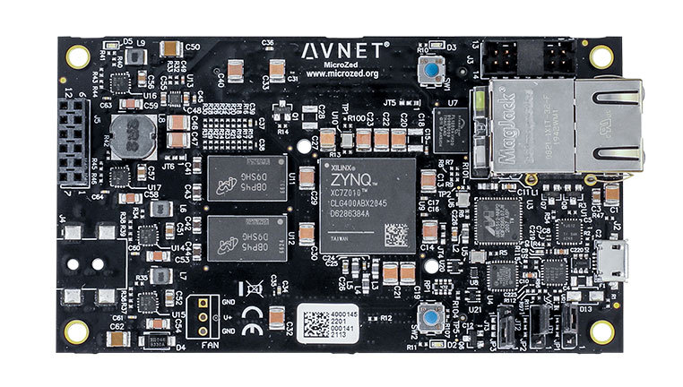

.. microzed:

Avnet MicroZed
#############

Overview
********

The Avnet MicroZed is a system on module (SOM) based on the Xilinx Zynq-7000 SoC. It
connects various peripherals with the SoC, which integrates two Cortex-A9 cores, FPGA
(Programmable Logic) and several interfaces.

   Avnet MicroZed (Credit: Avnet)

Hardware
********

The MicroZed has the following key features:

- Dual core Cortex-A9
- 1 GB DDR3 memory
- 128 MB QSPI Flash
- 10/100/1000 Ethernet
- Two 100-pin MicroHeader ports
- USB-UART bridge via Micro-USB port
- MicroSD card slot
- User button, LED
- 33.333 MHz on-board oscillator

Supported Features
==================

Zephyr supports these interfaces:

.. list-table::
   :header-rows: 1

   * - Interface 
     - Controller
     - Driver
   * - GICv1
     - on-chip
     - Arm Generic Interrupt Controller v1 
   * - ARCH TIMER
   	 - on-chip
     - ARM architecture timer
   * - Triple Timer Counters 
     - on-chip
	 - Xilinx PSTTC timer 
   * - PINCTRL
	 - on-chip
	 - pinctrl
   * - GPIO
	 - on-chip
	 - gpio
   * - UART
     - on-chip
	 - serial port-polling, serial port-interrupt
   * - Ethernet
   	 - on-chip
	 - eth-xilinx-gem

Programming and Debugging
*************************

Flashing
========

The following example shows how to boot Zephyr using Das U-Boot, a second-stage
bootloader, which officially supports this board. See the U-boot documentation
for instructions on how to prepare and flash the bootloader image onto an SD card.

Debugging
=========

TODO

References
**********

.. _MicroZed TRM: https://www.avnet.com/wps/wcm/connect/onesite/58eaef36-f0b2-4dd4-8440-540bdc2acd3d/5276-MicroZed-HW-UG-v1-7-V1.pdf?MOD=AJPERES&CACHEID=ROOTWORKSPACE.Z18_NA5A1I41L0ICD0ABNDMDDG0000-58eaef36-f0b2-4dd4-8440-540bdc2acd3d-nDjezWU

